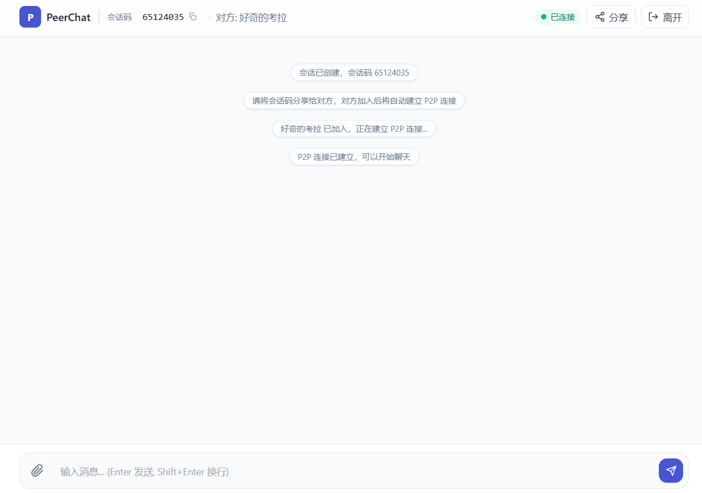
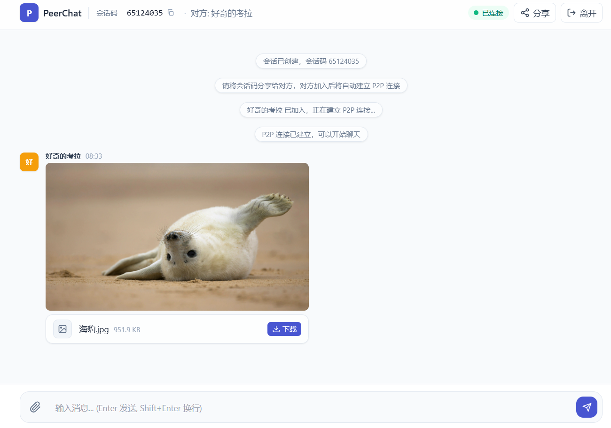
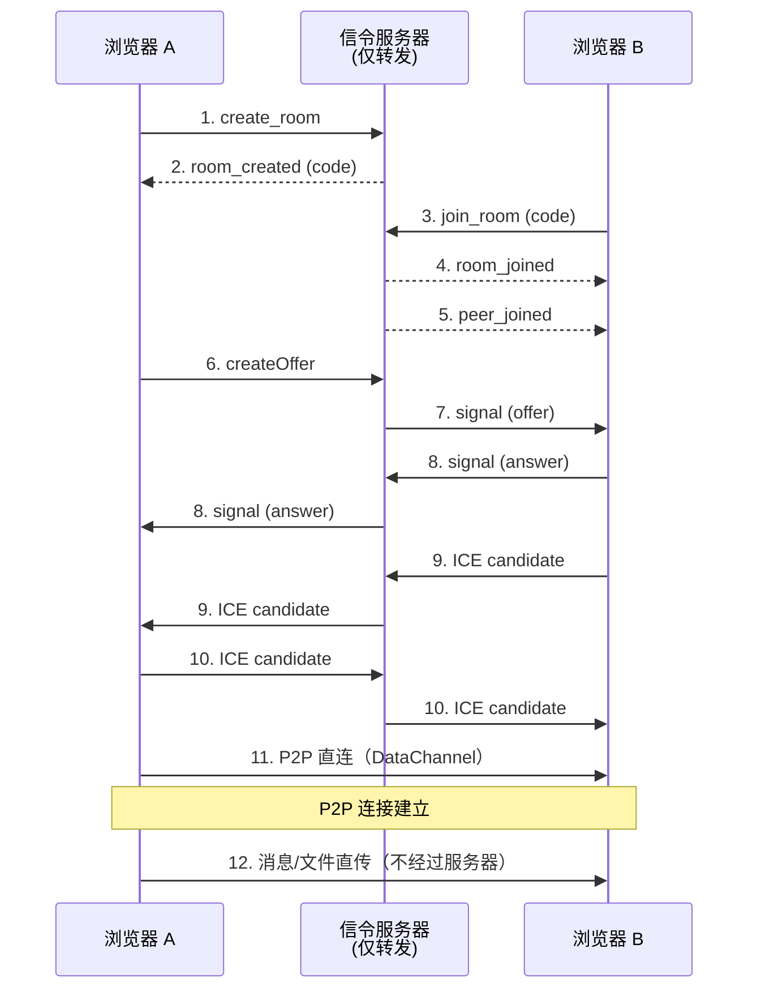

# PeerChat

> 一个基于 WebRTC 的 P2P 局域网直连聊天工具 —— 消息与文件直传，**全程不经过服务器**。


---

## ✨ 特性

| 特性 | 说明 |
|-----|------|
| 🔗 **纯 P2P** | 消息与文件直接在两台浏览器之间传输，服务器只做信令 |
| 🌐 **局域网友好** | 支持内网部署，自动处理 Chrome 的 `.local` IP 匿名化问题 |
| 📁 **文件传输** | 支持发送任意大小文件（分片传输），图片可直接预览 |
| 💬 **会话码加入** | 8 位数字会话码，简单直观的配对方式 |
| 🎨 **时间线样式** | 连续消息自动合并，阅读体验舒适 |
| ⚡ **低依赖** | 前端：HTML + Tailwind（纯静态） / 后端：仅一个 WebSocket 库 |
| 🪟 **跨平台** | Python 版 / Node.js 版后端，可打包为单文件 exe |

---

## 

### 入口页

输入昵称 → 创建会话 / 加入会话（对方发来的 8 位码）


### 聊天页

- 左侧对方头像 + 时间，右侧"我"的消息
- 文件/图片附件框内展示，点击可下载/预览



### 文件传输

- 文件分片上传，有进度条
- 图片直接内嵌缩略图，点击放大



---

## 🚀 快速开始

### Python

```bash
pip install -r requirements.txt
python server.py
```

打开浏览器访问：<http://localhost:8000>

> 内网部署时，先执行 `python download_tailwind.py` 把 Tailwind 下载到本地，
> 这样前端静态文件就能在纯内网环境跑。

---

## 📖 使用说明

1. 在两台内网机器（或同一台机器开两个标签）上各打开 <http://机器IP:8000>
2. 一端点 **「创建会话」**，得到 8 位会话码
3. 另一端输入会话码，点 **「加入会话」**
4. 稍等几秒建立 P2P 连接（右上角状态灯变绿表示已连接）
5. 开始聊天或发送文件 🎉

---

## 🏗 项目结构

```
PeerChat/
├── server.py              # Python 版信令服务器（WebSocket + 静态文件）
├── server.js              # Node.js 版信令服务器（可选，用于内网打包）
├── download_tailwind.js   # 下载 Tailwind 到本地（内网部署第一步）
├── requirements.txt       # Python 依赖：websockets
├── package.json           # Node.js 依赖：ws
├── static/
│   ├── index.html         # 入口页 + 聊天页（单页面）
│   ├── tailwind.js        # 由 download_tailwind.js 生成（内网环境必须有）
│   └── js/
│       ├── utils.js       # 共享 state、工具函数、随机昵称
│       ├── ui.js          # 界面渲染、消息/文件气泡、状态灯
│       ├── webrtc.js      # PeerConnection 生命周期、DataChannel、SDP 重写
│       ├── file.js        # 文件分片传输、进度条
│       ├── signal.js      # WebSocket 连接管理、信令消息路由
│       └── app.js         # 入口初始化、输入框/文件选择绑定
└── README.md
```

---

## 🔧 技术原理

### P2P 连接流程



### 为什么能在纯内网跑？

- **`iceServers = []`** 只收集 host 类型 candidate（本机/局域网 IP），不依赖 STUN/TURN 服务器
- **`.local` IP 重写**：Chrome 在某些网络环境把本地 IP 匿名成 UUID 字符串，`webrtc.js` 里 `rewriteSDP()` 在发送前把它换回真实 IP
- **UDP 打洞**：只要两台机器在同一网段且 UDP 不通被防火墙拦截，就能直连

---

## 🐛 故障排查

### "一直等待 P2P 连接建立" / 永远连不上

打开 F12 Console，找 `[P2P]` 开头的日志，按顺序检查：

| 现象 | 可能原因 | 解决 |
|------|---------|------|
| Console 有 `SDP candidate 重写: xxx.local -> IP` | ✅ SDP 重写正常 | 继续看下一步 |
| `iceConnectionState` 一直停在 `new` | candidate 全是 `.local` 或无效 | 用 `http://机器IP:8000` 而不是 `localhost` 访问 |
| `iceConnectionState` 停在 `checking` | UDP 不通 / 跨网段 | 1. 临时关防火墙测试<br>2. 确认两台机器在同一网段 |
| `Connection state: failed` | 浏览器策略禁用 WebRTC | 检查 `chrome://flags` 或企业组策略 |

### UDP 连通性手动测试（PowerShell）

**机器 A（监听）**：
```powershell
$endpoint = New-Object System.Net.IPEndPoint([System.Net.IPAddress]::Any, 55555)
$udp = New-Object System.Net.Sockets.UdpClient($endpoint)
Write-Host "✅ 监听中..."
while ($true) { $bytes = $udp.Receive([ref]$endpoint); Write-Host "收到: $([System.Text.Encoding]::ASCII.GetString($bytes))" }
```

**机器 B（发送）**：
```powershell
$udp = New-Object System.Net.Sockets.UdpClient
$msg = [System.Text.Encoding]::ASCII.GetBytes("hello")
$udp.Send($msg, $msg.Length, "机器A的IP", 55555) | Out-Null
```

如果机器 A 没收到 → 防火墙拦了 UDP，加白名单规则。

---

## 📝 常见问题

**Q：两台机器不在同一 VLAN 能连吗？**
A：默认只收集 host candidate（局域网直连）。如果要跨网段，需要在
`static/js/webrtc.js` 里给 `RTCPeerConnection` 加上 STUN 服务器配置。

**Q：传输安全吗？**
A：WebRTC 的 DataChannel 内置 DTLS-SRTP 加密，浏览器原生实现，
你发送的消息与文件在传输过程中是加密的。

**Q：文件存在哪？关了浏览器还能拿到吗？**
A：纯浏览器内存。文件不会写到磁盘（发送方只读本地文件，接收方 Blob 于内存），
关闭页面即释放。

